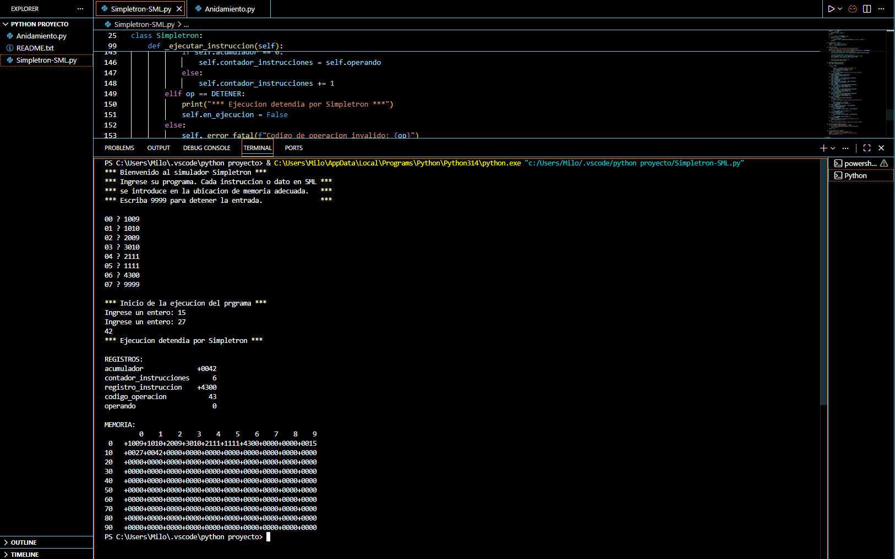
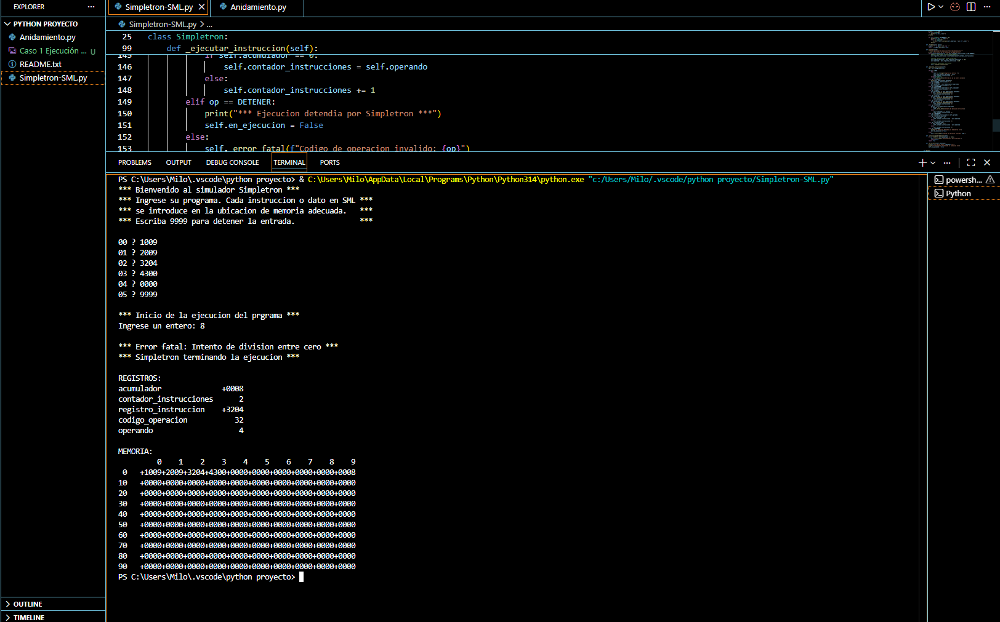

# Simulador Simpletron (SML) y Profundidad de Anidamiento
**Autor:** Carlo Emilio Caballero Robles - 3515208

## Descripción
Proyecto de la materia de Programación Avanzada. Incluye un simulador funcional
de la computadora virtual Simpletron (SML) capaz de ejecutar las 12 operaciones
básicas, y un programa adicional que evalúa la profundidad de anidamiento en
expresiones matemáticas mediante una pila.

## Archivos del Proyecto
1. `Simpletron-SML.py`: Simulador principal (memoria de 100 posiciones, ciclo fetch-decode-execute).
2. `Anidamiento.py`: Evaluador de expresiones usando pila.

## Instrucciones de Ejecución:

### Para el Simpletron:
Ejecutar en la terminal:

Ingresar las instrucciones SML línea por línea. Escribir `9999` para finalizar
la carga y comenzar la ejecución. El programa detecta automáticamente
desbordamientos, operaciones inválidas y divisiones entre cero, generando un
volcado de memoria al finalizar.

### Para el Evaluador de Anidamiento:
Ejecutar en la terminal:

Ingresar una expresión (ej. `{a + [b * (c - d)]}`). El programa devolverá
Verdadero (1) si está balanceada o Falso (0) si no lo está.

## Casos de Prueba

### Caso 1: Ejecución correcta (suma de dos números)
Programa cargado:

Entradas: `15` y `27` → Salida: `42`, seguido del volcado de registros y memoria.

Evidencia:

### Caso 2: Error fatal (división entre cero)
Programa cargado:

Entrada: `8` → El programa detecta la división entre cero, muestra el mensaje
de error fatal y genera el volcado completo de registros y memoria.

Evidencia:
